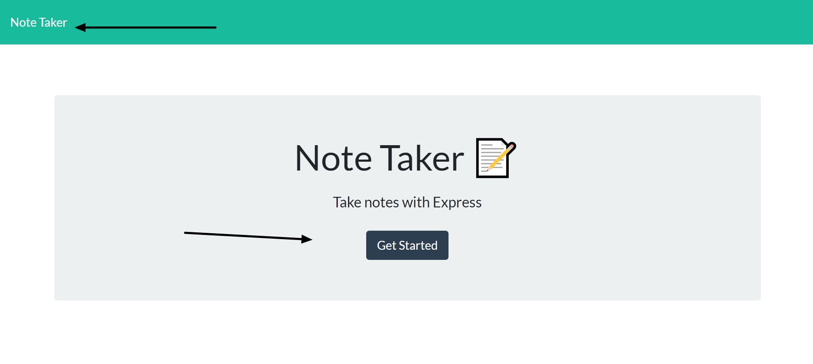
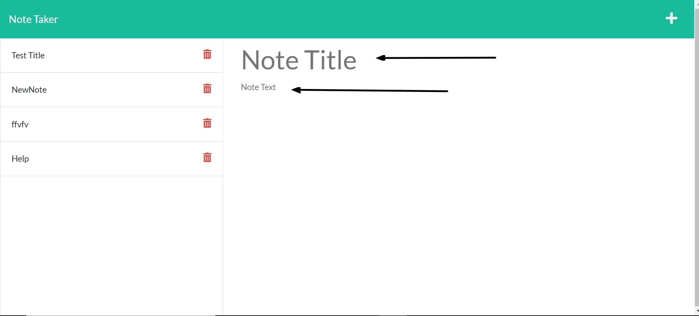
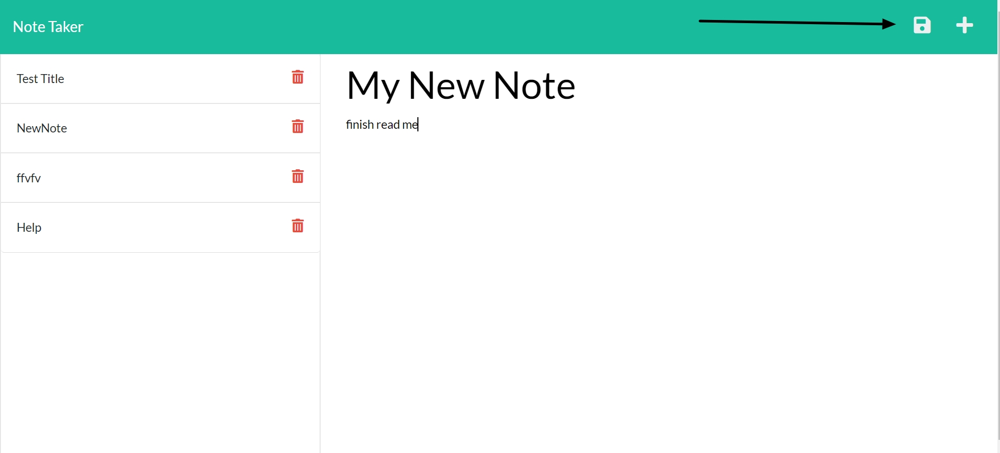
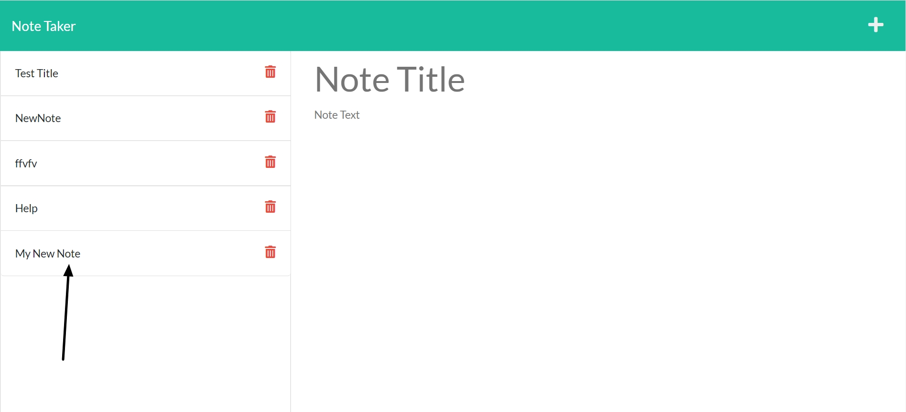
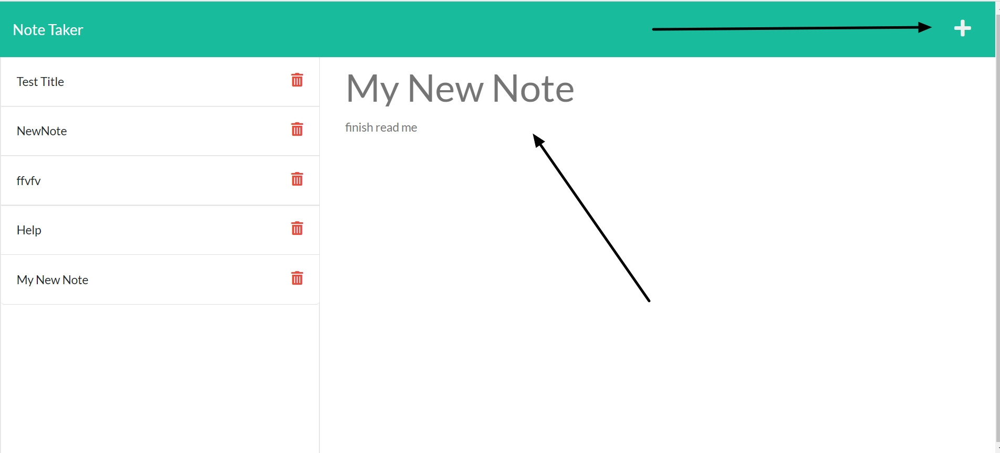

# Note Helper
  
<a href="https://github.com/originator1/Note_Helper" target="_blank">Note Helper on Github</a>

Version 1.0 \
Deployment: Nov 5, 2021 \
Contributors: 

- [James Garinger](https://github.com/originator1)
 

## Description
 Helps create, track and access notes in a more manageable and accessible way ... JSON!
## User Guide 
<!-- Deployed Link -->
Here you will find a step by step guide on how to navigate through the Note Helper Application. Below are images of each browser page and a description of the functionality for them. 

---
1. __Home Page__

This is our homepage, where you are initally directed to upon accessing our application. 

- Get Started button located directly in the middle of the page will take you to the notes page and start your list of notes!
- You also have the option to click the Note Taker button in the far left of the navigation bar at the very top of the page to take you back to this home page at any time. 

2. __Notes Page__

Once you have clicked get started fromt he home page you will be directed to a notes page. On this page you will be able to start writing your notes and storing them to the database!

- First thing you need to do to create a note is enter the title where you see Note Title placeholder text.
- Second, fill out the body of your note with whatever information you would like this note to have stored under the created title.

3. __Save Note Button__

Once you have entered in the title and the note text for your specified note, all you have to do is click the save icon that will populate at the top right of the page as soon as you have entered a input into both Note Title, and Note Text.

- After filling out the Note Title, and Note Text, a button will appear in the top right of page.
- Click the save note icon that appears in the top right corner of page and your note will now be saved! 

4. __Note saves to list on left side__

After clicking the save note button you will see it appear on left hand side here with all other saved notes.

5. __Displaying saved note and creating new note__

After saving the note and storing it to the list on the left side you are then able to click the created note title and the note will appear back in the note section. You can also click the plus icon button in the top right if you would like to create a brand new note.

- Click title of note you have created, to display in read only view
- click plus icon at top right of page to leave viewed note and create a brand new one!

---

### Built Utilizing
- Javascript
- Node JS
- Express

### Future Developments:
- Build out styling of application to be more UI friendly
- Storing data to actual MySQL database

### Contribute!
If you would like to make a contribution to this application or have any suggestions, feel free to
<a href="mailto:jkggaringer@gmail.com" target="_blank">Contact Us!</a>
